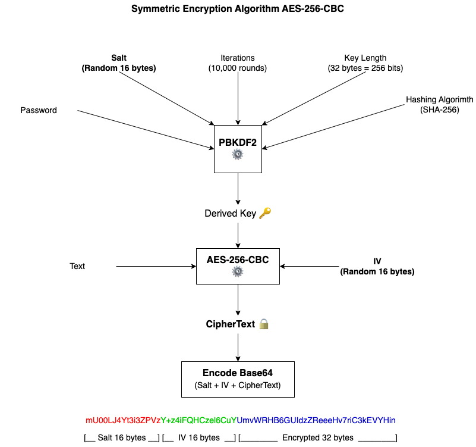

# Cross Platform Cryptography

Symmetric encryption algorithm using [AES-256](https://cryptobook.nakov.com/symmetric-key-ciphers/aes-cipher-concepts) with [CBC mode](https://cryptobook.nakov.com/symmetric-key-ciphers/cipher-block-modes) and key derivation function [PBKDF2](https://cryptobook.nakov.com/mac-and-key-derivation/pbkdf2)

## Languages Supported

- Swift 5 (Common Crypto)
- Kotlin 1.8, Java 17 (Crypto API)
- Node.js 16 (Crypto Module)
- Vue.js 3 (Crypto-JS)

## Input

- **Text** (String): Text message to be encrypt (UTF-8).
- **Password** (String): 8-10 chars minimal length is recommended.

## Output

- **Encrypted** (String): Concatenated (Salt + IV + CipherText) in Base64 format.

 

## References

- [OWASP MASTG iOS Cryptographic](https://mobile-security.gitbook.io/mobile-security-testing-guide/ios-testing-guide/0x06e-testing-cryptography)
- [Crypto Book by Svetlin Nakov](https://cryptobook.nakov.com)
- [AES256-CBC File Encryption from the Command Line with Swift](https://medium.com/@eneko/aes256-cbc-file-encryption-from-the-command-line-with-swift-cd1f88f2e1ec)
- [Multi-Platform AES Encryption](https://github.com/piyapan039285/Multi-platform-AES-Encryption)
- [4 ways of Symmetric Cryptography in JavaScript](https://dev.to/halan/4-ways-of-symmetric-cryptography-and-javascript-how-to-aes-with-javascript-3o1b)
